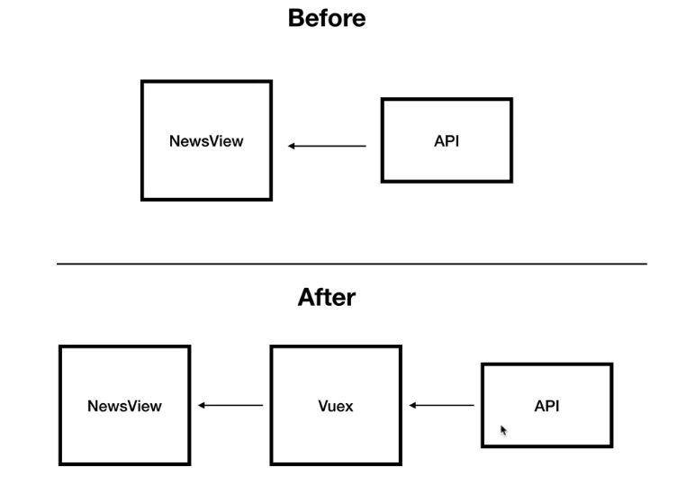

# Vuex로 스토어 구현

### 구조의 차이

- Vuex를 이용해 데이터를 스토어에 넣은 후 그걸 꺼내다 쓰는 구조를 만들어 보자.  

### 설치

    npm i vuex

    
### store구현

    // src/store/index.js 파일 만들고
    import Vue from 'vue';
    import Vuex from 'vuex';
    import { fetchNewsList } from '../api/index'

    Vue.use(Vuex); // vuex는 플러그인 형태로 제공되기 때문에 이렇게 사용해 준다..?

    export const store = new Vuex.Store({
        state: {
            news: []
        },
        mutations: {
            SET_NEWS(state, news) {
                state.news = news;
            }
        },
        actions: {
            FETCH_NEWS(context) {
                fetchNewsList()
                    .then(res => {
                        context.commit('SET_NEWS', res.data);
                    })
                    .catch(err => {
                        console.log(err);
                    });
            },
            FETCH_JOBS({commit}) {     // 이렇게 구조분해 할당으로 받는 것도 가능
                fetchJobsList()
                    .then(({data}) => {
                        commit('SET_JOBS', data);      // 이렇게 구조분해 할당으로 받는 것도 가능
                    })
                    .catch(err => {
                        console.log(err);
                    })
        }
        }
    });
    
    
    // main.js
    
    import Vue from 'vue';
    import App from './App.vue';
    import { router } from './routes/index.js';
    import { store } from './store/index.js';

    Vue.config.productionTip = false

    new Vue({
      render: h => h(App),
      router,
      store
    }).$mount("#app");
    
    
    // NewsView.vue
    <template>
    

        
{{ user.title }}

       

    </template>

    
    
    
    
 참고 : https://vuex.vuejs.org/

### 헬퍼함수 사용하기

    // AskView.vue
    <template>
        

            
{{ item.title }}

        

    </template>

    
    
    
    // store.js
    
    import Vue from 'vue';
    import Vuex from 'vuex';
    import { fetchNewsList, fetchJobsList, fetchAskList } from '../api/index'

    Vue.use(Vuex); // vuex는 플러그인 형태로 제공되기 때문에 이렇게 사용해 준다..?

    export const store = new Vuex.Store({
        state: {
            ask : []
        },
        mutations: {
            SET_ASK(state, ask) {
                state.ask = ask;
            }
        },
        getters: {
            fetchedAsk(state) {
                return state.ask;
            }
        },
        actions: {
            FETCH_ASK({commit}) {
                fetchAskList()
                    .then(({data}) => {
                        commit('SET_ASK', data);
                    })
                    .catch(err => {
                        console.log(err);
                    });
            }
        }
    });

스프레드연산자 참고 : https://joshua1988.github.io/es6-online-book/spread-operator.html
