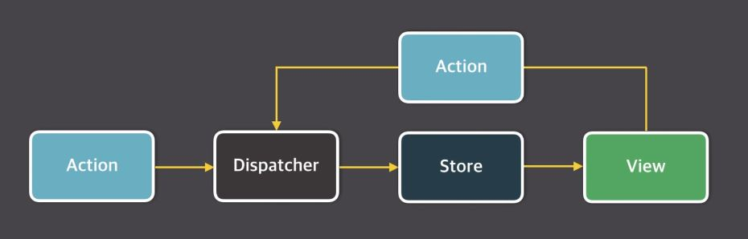

# Vuex 소개

### 개요

 - 복잡한 애플리케이션의 컴포넌트들을 효율적으로 관리하는 Vuex 라이브러리 소개  
 - Vuex 라이브러리의 주요 속성인 Flux 패턴 소개  
 - Vuex 라이브러리의 주요 속성인 state, getters, mutations, actions 학습  
 - Vuex를 더 쉽게 코딩할 수 있는 방법인 Helper 기능 소개  
 - Vuex로 프로젝트를 구조화하는 방법과 모듈 구조화 방법 소개  
 
 
 
 
 
### Vues란?

 - 무수히 많은 컴포넌트의 데이터를 관리하기 위한 상태 관리 패턴이자 라이브러리  
 - React의 Flux 패턴에서 기인함  
 - Vue.js 중고급 개발자로 성장하기 위한 필수 관문  
 
 

### Flux란?
 - MVC패턴의 복잡한 데이터 흐름 문제를 해결하는 개발 패턴 -> Unidirectional data flow  
 모든 데이터의 흐름이 한 방향으로 흐름. 거대한 어플리케이션으로 발전했을 때 복잡해질 것을 미리 방지  
 예를 들면, 부모가 자식에게 프롭스로 데이타를 물려주고 자식은 이벤트로 데이터를 전달  
 
      Action -> Dispatcher -> Model -> View
      
 1. action : 화면에서 발생하는 이벤트 또는 사용자의 입력  
 2. dispatcher : 데이터를 변경하는 방법, 메서드  
 3. model : 화면에 표시할 데이터  
 4. view : 사용자에게 비춰지는 화면
 
 
 
 
 
 ### MVC 패턴의 문제점
 
 - 기능 추가 및 변경에 따라 생기는 문제점을 예측할 수 없음.(예) 페이스북 채팅 화면
 - 앱이 복잡해지면 생기는 업데이트 루프
 
 
 
 
 
 
### Flux 패턴의 단방향 데이터 흐름
 - 데이터의 흐름이 여러 갈래로 나뉘지 않고 단방향으로만 처리하기 때문에 예측이 가능
  
 - 액션이 발생하면 디스패쳐가 스토어를 바꾸고 스토어에 의해서 화면이 갱신, 또 화면에서 사용자가 액션을 일으키면 디스패쳐->스토어->뷰 이런 패턴  

 
      

