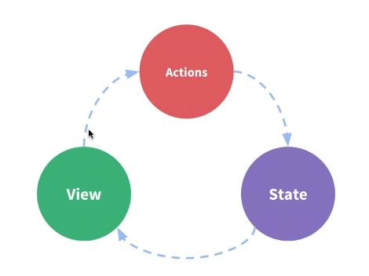
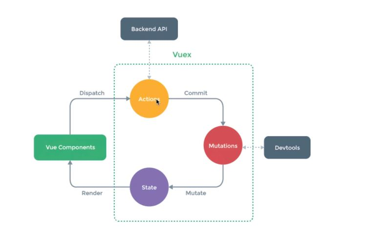

# Vuex가 필요한 이유

### Vuex가 왜 필요할까?
 - 복잡한 애플리케이션에서 컴포넌트의 개수가 많아지면 컴포넌트 간에 데이터 전달이 어려워진다.
  
  
  
### 이벤트 버스로 해결?
 - 어디서 이벤트를 보냈는지 혹은 어디서 이벤츠를 받았는지 알기 어려움  
 - 컴포넌트 간 데이터 전달이 명시적이지 않음  
 
 
 
 
### Vuex로 해결할 수 있는 문제
 - MVC 패턴에서 발생하는 구조적 오류  
 - 컴포넌트 간 데이터 전달 명시 
 - 여러 개의 컴포넌트에서 같은 데이터를 업데이트 할 때 동기화 문제  
 
 
### Vuex 컨셉
 - state : 컴포넌트 간에 공유하는 데이터 data()  
 - View : 데이터를 표시하는 화면 template  
 - Action : 사용자의 입력에 따라 데이터를 변경하는 methods  
 
   
 
  - 단방향 데이터 흐름 처리를 단순하게 도식화한 그림
  
  
  
### Vuex 구조
 - 컴포넌트 -> 비동기 로직 -> 동기 로직 -> 상태
 
    
  
 - 화면에서 트랜젝션을 일으키면 Actions에서 Backend API 호출, 이곳에서 데이터를 직접 변경하지는 않음  
 - 데이터를 변경하는 Mutations를 호출  
 - Mutations에서 State를 갱신  
 
      
