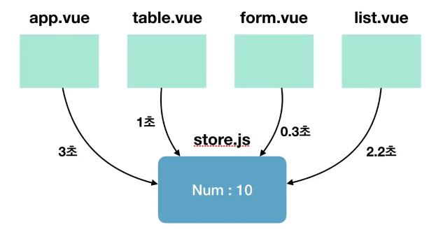

# Vuex 기술 요소

- state : 여러 컴포넌트에 공유되는 데이터 data  
- getters : 연산된 state 값을 접근하는 속성 computed  
- mutations : state 값을 변경하는 이벤트 로직과 메서드 methods  
- actions : 비동기 처리 로직을 선언하는 메서드 async methods -->api call할때 사용   

### state 란?

- 여러 컴포넌트 간에 공유할 데이터 - 상태  

      // Vue  
      data : {
            message : 'Hello Vue.js!'
      }
      
      // Vuex  
      state : {
            message : 'Hello Vue.js!'
      }
      
      // 접근방법
      
      <!-- Vue -->
      
{{ message }}

      
      <!-- Vuex -->
      
{{ this.$store.state.message }}

      
      
### getters 란?
 - state값을 접근하는 속성이자 computed() 처럼 미리 연산된 값을 접근하는 속성
 
            // store.js
            state : {
                  num : 10
            },
            getters : {
                  getNumber(state) {
                        return state.num;
                  },
                  doubleNumber(state) {
                        return state.num * 2;
                  }

            }

            // 접근 방법
            
{{ this.$store.getters.getNumber }}

            
{{ this.$store.getters.doubleNumber }}

      
- 나중에 배우게될 헬퍼함수로 축약해서 접근 가능  

### mutations 란?

 - state의 값을 변경할 수 있는 유일한 방법이자 메서드  
 - 뮤테이션은 commit()으로 동작시킨다.
 
          // store.js
          state : { num : 10},
          mutations : {
                printNumbers(state) {
                      return state.num
                },
                sumNumbers(state, anotherNum) {
                      return state.num + anotherNum;
                }
          }

          // App.vue
          this.$store.commit('printNumbers');
          this.$store.commit('sumNumbers', 20);

### mutations의 commit() 형식
 - state를 변경하기 위해 mutations를 동작시킬 때 인자(payload)를 전달할 수 있음  
 
           // store.js
           state : { storeNum : 10 },
           mutations : {
                 modifyState(state, payload) {
                       console.log(payload.str);
                       return state.storeNum += payload.num;
                 }
           }

           // App.vue
           this.$store.commit('modifyState', {
                 str : 'passed from payload',
                 num : 20
           });
           
     
 
### state는 왜 직접 변경하지 않고 mutation로 변경할까?
 - 여러 개의 컴포넌트에서 아래와 같이 state값을 변경하는 경우 어느 컴포넌트에서 해당 state를 변경했는지 추적하기 어렵다.
 
    methods : {
       increaseCounter() { this.$store.state.counter++;}
    }
    
 - 특정 시점에 어떤 컴포넌트가 state를 접근하여 변경한 건지 확인하기 어렵기 때문  
 - 따라서, 뷰의 반응성을 거스르지 않게 명시적으로 상태 변화를 수행.반응성, 디버깅, 테스팅 혜택.

### actions란?
 - 비동기 처리 로직을 선언하는 메서드. 비동기 로직을 담당하는 mutations  
 - 데이터 요청, Promise, ES6 async과 같은 비동기 처리는 모두 actions에 선언  
 
      // store.js
      state: {
            num : 10
      },
      mutations: {
            doubleNumber(state) {
                  state.num * 2;    ③ state 를 변경
            }
      },
      actions: {
            delayDoubleNumber(context) { // context로 store의 메서드(mutations)와 속성 접근
                  context.commit('doubleNumber'); ② mutations 로 가서 메서드 찾음
            }
      }
      
      // App.vue
      this.$store.dispatch('delayDoubleNumber'); ① actions로 가서 메서드를 찾음
      
      
      
      
  #### actions 비동기 코드 예제
  
      // store.js
      mutations: {
            setData(state, fetchedDate) {
                  state.product = fetchedData;
            }
      },
      actions: {
            fetchProductData(context) {
                  return axios.get('https://domain.com/product/1')
                              .then(response => context.commit('setData', response));
            }
      }
      
      // App.vue
      methods : {
            getProduct() {
                  this.$store.dispatch('fetchProductData');
            }
      }
      
      
  ### 왜 비동기 처리 로직은 actions에 선언해야  할까?
   - 언제 어느 컴포넌트에서 해당 state를 호출하고, 변경했는지 확인하기가 어려움  
   
   [그림] 여러 개의 컴포넌트에서 mutations로 시간 차를 두고 state를 변경하는 경우  
  #### 결론 : state 값의 변화를 추적하기 어렵기 때문에 mutations 속성에는 동기 처리 로직만 넣어야 한다.
      
